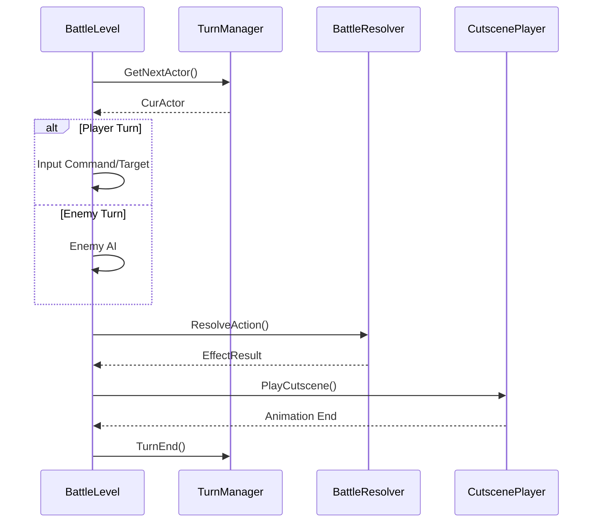

# 전투 구조 (Battle Structure)

2ndConsoleGame의 전투 시스템은 턴 기반 명령 선택 방식과 상태 머신 기반의 페이즈 전환 로직을 기반으로 설계되었습니다.

## 1. 전투 흐름 제어 (BattleLevel)

전투 레벨은 `IBattleLevel` 인터페이스를 상속하며, 여러 페이즈(Phase)를 거치며 진행됩니다.

### 1.1 주요 페이즈 (Phase)
- **Phase_Init**: 전투 참가자 설정 및 초기화.
- **Phase_Start**: 전투 시작 시각적 연출.
- **Phase_TurnCheck**: `TurnManager`를 통해 다음 행동 액터 선정.
- **Phase_CommandSelect**: 플레이어 캐릭터의 명령(공격, 스킬, 아이템) 입력 대기.
- **Phase_TargetSelect**: 명령 대상(몬스터 등) 선택.
- **Phase_EnemyAI**: 적의 행동 결정 로직.
- **Phase_Animation**: 결정된 명령의 실행 및 시각적 연출(Cutscene).
- **Phase_Log**: 전투 결과를 로그에 기록.
- **Phase_Result**: 전투 승패 판정 및 보상 처리.

## 2. 전투 핵심 컴포넌트

### 2.1 BattleContext
전투 중 필요한 모든 정보와 서브시스템을 보유하는 중심 저장소입니다.
- `BattleResolver`: 대미지 계산 및 효과 판정.
- `CheckChainSystem`: 반격, 사망 체크 등 연쇄적인 효과 처리.
- `BattleLogSystem`: 전투 중 발생하는 사건 기록.
- `CutscenePlayer`: 컷신(애니메이션) 실행.

### 2.2 BattleResolver
- `ResolveBasicAtk()`: 기본 공격 처리.
- `ResolveAction()`: 스킬/아이템 등 `CombatEffectData`를 포함한 행동 처리.
- `CalcDmg()`, `CheckMiss()`, `CheckCritical()`: 수치 판정 로직.

### 2.3 TurnManager
- `GetNextActor()`: 캐릭터들의 속도(Speed) 등을 기준으로 다음 턴 액터를 결정합니다.

## 3. 명령 체계 (IBattleCommand)
- **AtkCommand**: 일반 공격.
- **SkillCommand**: 스킬 사용.
- **ItemCommand**: 아이템 사용.
- **RunCommand**: 도주 시도.

---
## 전투 시퀀스 (단순화)

