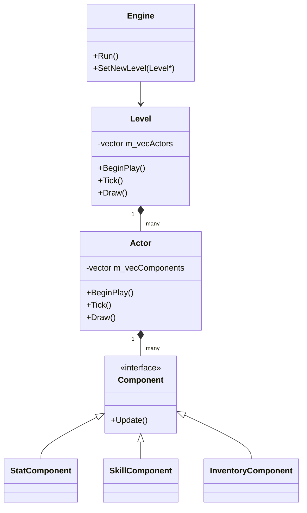

# 엔진 구조 (Engine Structure)

2ndConsoleGame 엔진(`Wannabe` 네임스페이스)은 컴포넌트 기반 액터 시스템과 상태 머신 기반 레벨 관리 방식을 채택하고 있습니다.

## 1. 핵심 아키텍처

### 1.1 Engine 클래스 (`Wannabe::Engine`)
시스템의 최상위 클래스로, 게임 루프를 관리합니다.
- **Run()**: `BeginPlay()`, `Tick()`, `Draw()`를 포함하는 메인 루프를 실행합니다.
- **Level 관리**: `SetNewLevel()`을 통해 현재 활성화된 레벨을 교체합니다.
- **서브시스템**: `Input`, `Renderer`, `RenderSystem`을 소유하고 관리합니다.

### 1.2 Level 클래스 (`Wannabe::Level`)
게임의 특정 상태나 공간(타이틀, 필드, 전투 등)을 나타내는 단위입니다.
- **Actor 관리**: `m_vecActors` 리스트를 통해 해당 레벨에 존재하는 액터들을 관리합니다.
- **Lifecycle**: `BeginPlay()`, `Tick()`, `Draw()`를 통해 소속 액터들의 업데이트 및 렌더링을 제어합니다.

### 1.3 Actor & Component 시스템
액터-컴포넌트 패턴을 사용하여 기능을 확장합니다.
- **Actor**: 위치, 이미지, 팀 정보 등을 가지며 여러 컴포넌트를 보유할 수 있습니다.
- **Component**: `Stat`, `Status`, `Inventory`, `Skill`, `Display`, `Equipment` 등 특정 기능을 담당하며 액터에 부착됩니다.

## 2. 렌더링 시스템
- **ScreenBuffer**: 콘솔 화면 버퍼를 관리합니다.
- **Canvas**: 실제로 문자를 그리는 캔버스 역할을 합니다.
- **Renderer**: 최종적으로 콘솔에 출력하는 역할을 수행합니다.
- **Camera**: 레벨 내의 특정 영역을 비추고 좌표 변환을 담당합니다.

## 3. 데이터 관리
- **DataManager**: JSON 등 외부 파일에서 로드된 플레이어, 몬스터, 스킬/아이템 데이터를 캐싱하고 제공합니다.
- **SaveManager**: 게임의 진행 상황을 저장하고 불러오는 기능을 담당합니다.

---
## 클래스 다이어그램 (간략화)

